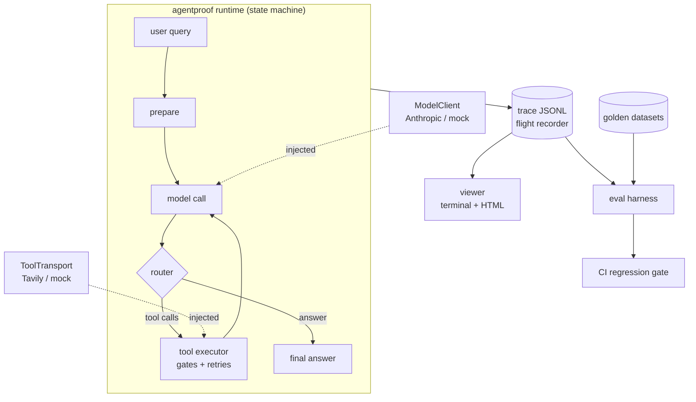

# AgentProof

[](https://github.com/HelloJahid/AgentProof/actions/workflows/ci.yaml)
[](https://www.python.org/)
[](LICENSE)

> **PromptProof made prompts trustworthy. AgentProof makes agents measurable.**
> A from-scratch agent runtime where every run is recorded, replayed, and scored.

AgentProof is stage 2 of a build-in-public series that began with
[PromptProof](https://github.com/HelloJahid/PromptProof). No LangGraph, no CrewAI —
the runtime is ~1,500 lines of readable Python, because the point is to show the
mechanics: how an agent loop actually works, and how you *prove* it works.

**The thesis:** most "agent from scratch" repos stop at the loop, and most evaluation
tools assume you live inside someone else's framework. AgentProof builds both as one
inseparable design — an agent runtime with a **flight recorder** built into its spine
and an **evaluation harness** that judges the evidence.

## What's inside

- 🔁 **A state-machine agent runtime** — typed state (Pydantic), single-job steps,
  conditional routing, a step budget so loops can never mean forever.
- 🚪 **Gate-checked tool use** — the model's arguments are validated *before* the world
  is touched; the world's responses are validated *before* the model sees them.
  Transient failures retry invisibly; permanent ones become structured errors the
  agent can reason about.
- ✈️ **A trajectory flight recorder** — every run writes a crash-safe JSONL trace
  (every thought, tool call, observation, gate outcome, token count, timing). Any
  run reconstructs fully from its file alone: *if it isn't in the trace, it didn't
  happen.*
- 📊 **A first-class evaluation harness** — golden datasets, rule evaluators across
  four dimensions (task completion, quality, tool interaction, system metrics),
  three lenses (final response, single step, trajectory), a bias-aware LLM-as-judge,
  and a **CI regression gate** that fails the build when behavior breaks.
- 🔍 **A trajectory viewer** — any trace file becomes a terminal story or a
  self-contained HTML report.
- 🌐 **A demo agent** — a grounded web researcher that must cite a source URL for
  every claim, and says so honestly when it can't.

Everything runs **fully mocked by default**: 90+ tests and the CI eval gate need no
API keys and no network. The live model (Anthropic) and live search (Tavily) are
injected through the same two interfaces the mocks implement.

## How this differs from PromptProof

Same toolbox, on purpose — it's a series. Different problem entirely:

| | [PromptProof](https://github.com/HelloJahid/PromptProof) (stage 1) | AgentProof (stage 2) |
| --- | --- | --- |
| **Core question** | Can I trust this *output*? | Can I trust a *system that picks its own path*? |
| **Control flow** | Fixed prompt chain — the path is decided at design time | State machine + router — the path is decided at runtime by the model's behavior |
| **Observability** | `RunTrace`: a linear step log | Flight recorder: crash-safe, replayable trajectory with full state snapshots + viewer |
| **Quality enforcement** | At generation time — a feedback loop fixes *this* output | At development time — a CI gate grades *behavior* against golden cases on every push |
| **Evaluation** | Rule-based evaluator in the loop | Datasets, 4 dimensions, 3 lenses, tolerant trajectory checks, bias-aware LLM-as-judge, scorecards |
| **Architecture** | An application (fact-checker, CLI + GUI) | A runtime + eval harness; the demo agent is ~80 lines of configuration on top |

The shared DNA (Pydantic gates, retry-with-feedback, typed errors, injectable
clients, fully mocked tests) is deliberate: PromptProof's reliability patterns,
promoted from prompts to agents.

## Architecture



Two rules fall out of this picture:

1. **The trace is the single source of truth.** The viewer and every evaluator consume
   the same replay, never the live process — so any verdict can be re-verified from
   the file it points at.
2. **Reasoning is separated from execution.** The model states intent; injectable
   transports act. Swapping live for mock is a constructor argument, not a code path.

## Quickstart

```bash
git clone https://github.com/HelloJahid/AgentProof.git
cd AgentProof
python -m venv .venv && . .venv/bin/activate   # Windows: .venv\Scripts\activate
pip install -e ".[dev]"
```

**1. Prove everything works — no keys, no network:**

```bash
python -m pytest
```

**2. Run the eval gate (what CI runs on every push):**

```bash
python -m demo.researcher.evalsuite --trace-dir runs/evals --scorecard runs/evals/scorecard.json
```

```
[PASS] gtc-announcement  (finished)
       path: prepare -> model -> tools -> model
       PASS answer_matches_reference: answer matches pattern /\[https:///
       PASS within_budgets: within budgets: 4 steps, 1130 tokens
       ...
overall: 3/3 cases passed (100%)
eval gate: PASS
```

**3. View a trajectory:**

```bash
python -m agentproof.trace runs/evals/gtc-announcement.trace.jsonl --html report.html
```

**4. Go live** — put keys in a `.env` file
(`ANTHROPIC_API_KEY=...` and `TAVILY_API_KEY=...`, free tier at [tavily.com](https://tavily.com)):

```bash
python -m demo.researcher "What did NVIDIA announce at its most recent GTC event?"
```

The answer arrives with a citation after every claim, and the full trajectory lands
under `runs/` — feed it to the viewer to watch the agent search, reflect, reformulate,
and synthesize.

**5. The live eval** — same golden cases, real model and search, plus the LLM-as-judge
grading groundedness against a fixed rubric:

```bash
python -m demo.researcher.evalsuite --live --trace-dir runs/eval-live
```

## Repo map

```
agentproof/
  state.py       typed working memory: the one object every step reads and writes
  machine.py     the execution loop: steps, router, step budget
  llm.py         ModelClient port: mock + thin Anthropic wrapper
  memory.py      short-term memory as a VIEW (full / sliding window / summarising)
  errors.py      typed failures: GateFailure, ToolFailure, TransitionError, ...
  steps/         prepare, model_call, tool_exec, routers
  tools/         registry (declarations + validation), executor (gates + retries),
                 transports (Tavily + mock)
  trace/         recorder (JSONL), replay (+ integrity checks), viewer (text + HTML)
  evals/         datasets, rule checks, LLM-as-judge, harness, scorecard, CI gate
demo/researcher/ the grounded web researcher + its golden scripts + evalsuite CLI
datasets/        golden eval cases (JSONL)
tests/           fully mocked pytest suite
```

## Design choices worth stealing

- **Mocks live in the package, not in tests.** A fully-mocked test suite is a design
  requirement, so `MockModelClient` and `MockTransport` are first-class citizens.
- **Failure diagnosis determines retry policy.** Bad arguments are the *model's*
  mistake — feedback, no retry. Bad payloads are the *world's* — retry, then a
  structured error. The reasoning chain never sees a raw traceback.
- **Memory is a view, not a mutation.** The state keeps the full conversation (the
  trace needs the truth); a memory policy decides how much the model sees.
- **A broken measuring stick is never a grade.** A judge that can't produce a valid
  verdict raises `EvalFailure` — distinct, loudly, from a failing agent.
- **One trace file is one run.** Truncated traces load (a crash is when the black box
  matters most); corrupted ones are rejected.

## Development

```bash
pip install -e ".[dev]"
ruff check . && ruff format --check .   # lint + formatting
python -m pytest                         # 90+ tests, no keys, no network
python -m demo.researcher.evalsuite      # the eval gate CI runs on every push
```

Ground rules for contributions: no agent frameworks (the runtime stays readable,
from-scratch Python); every data boundary gets a Pydantic schema; the test suite
must never need a network or an API key — live services stay behind the
`ModelClient` / `ToolTransport` ports.

## The series

1. **PromptProof** ([repo](https://github.com/HelloJahid/PromptProof)) — self-correcting
   prompting: chaining, Pydantic gate checks, gate-checked ReAct, feedback loops.
2. **AgentProof** (this repo) — the agent as a state machine, the flight recorder,
   and evaluation as a first-class deliverable. Articles to follow.

## License

[MIT](LICENSE)
